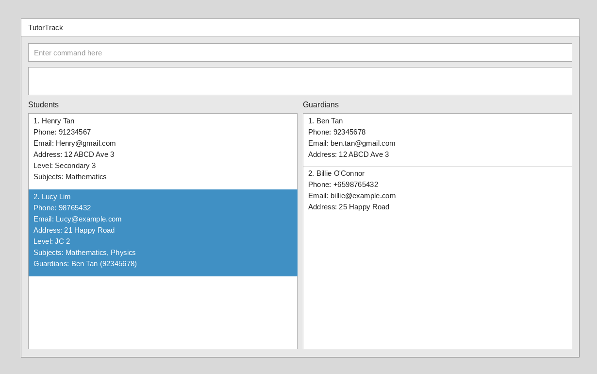

# TutorTrack

* This is a **desktop application for private tutors** to manage their students and guardians in one place.

  * It allows tutors to store and manage contact details and academic information.
  * It supports relationships between students and their guardians.
  * It provides search and filtering features to help tutors quickly find relevant contacts.
  
* TutorTrack is **written in an object-oriented programming (OOP) style** and is designed as an ongoing software project.
* The application uses a **command-based interface** for managing contacts efficiently.
* For the detailed documentation of this project, see the [TutorTrack Product Website](https://ay2627s1-cs2103t-t15-3.github.io/tp/).
This includes documentation related to the product requirements, features, and development of TutorTrack.

## Features

### Student Management

TutorTrack allows tutors to manage student records containing:

* Name
* Phone number
* Email
* Address
* Academic level
* Subjects

Students can be added, edited, removed, searched, and filtered.

### Guardian Management

Tutors can store guardian contact details including:

* Name
* Phone number
* Email
* Address

Guardians can be added, edited, removed, and searched independently from students.

## Acknowledgements

TutorTrack was developed as part of a software engineering project.

The project was based on the **AddressBook Level 3 (AB3)** project developed as part of the SE-EDU initiative.
