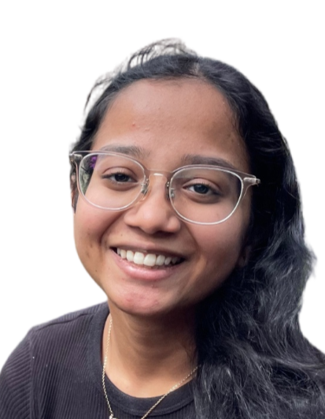
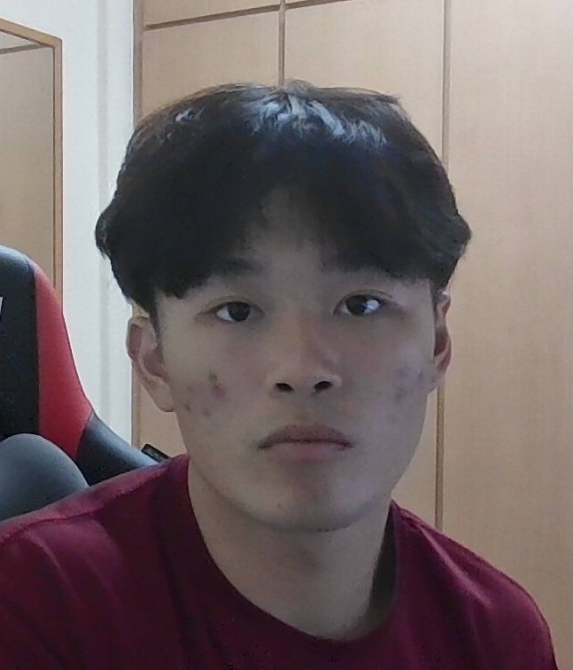
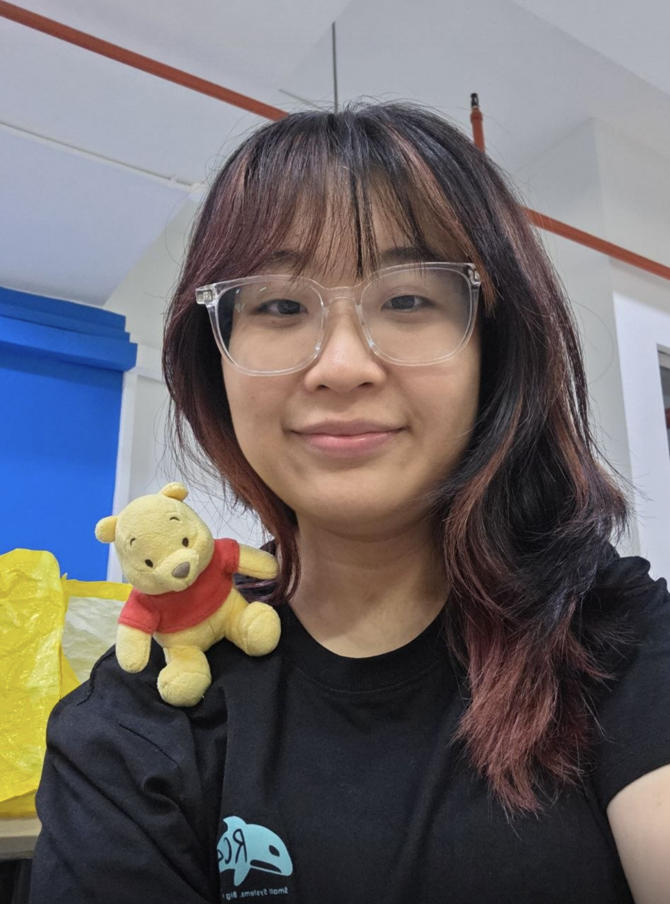
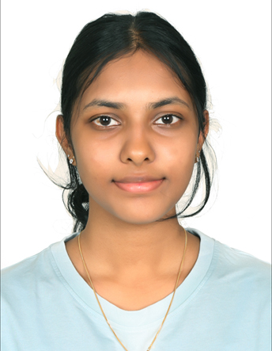
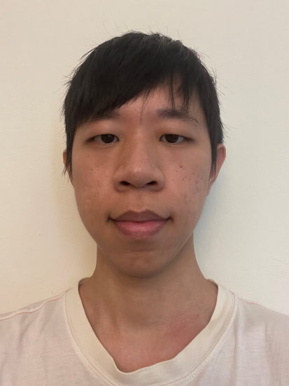

# About Us

We are a team based in the [School of Computing, National University of Singapore](http://www.comp.nus.edu.sg).

You can reach us at the email `seer[at]comp.nus.edu.sg`

## Project team

### Pratiksha Raghavan

[[github](https://github.com/pratixksha)]

* Role: Testing
* Responsibilities: Ensures the testing of the project is done properly and on time.

### Fu Lingyu

[[github](http://github.com/tchgf)]

* Role: Team Lead & Deliverables and deadlines
* Responsibilities: Ensures project deliverables are done on time and in the right format.

### Megan

[[github](https://github.com/megspq)]

* Role: Documentation
* Responsibilities: Responsible for the quality of various project documents

### Amritaa Varsni Ganapathi

[[github](https://github.com/Amritaa66)] 

* Role: Code quality
* Responsibilities: Looks after code quality, ensures adherence to coding standards, etc.

### Lucas Ngui

[[github](http://github.com/lucasngui)]

* Role: Integration
* Responsibilities: In charge of versioning the code, maintaining the code repository, and integrating various parts of the software to create a whole.
